# Entity Relationship Diagram (ERD)

## Database Schema Overview

This document provides a comprehensive Entity Relationship Diagram for the e-commerce platform database.

## ERD Diagram (Mermaid Format)

```mermaid
erDiagram
    %% User Management
    users {
        bigint id PK
        string name
        string email
        string password
        string phone
        enum gender
        string invitation_code
        bigint invited_by FK
        boolean is_active
        boolean is_verified
        string image
        string verification_code
        timestamp verification_code_expire
        int invited_count
        boolean has_invitation_discount
        string role
        decimal points
        timestamp created_at
        timestamp updated_at
    }

    addresses {
        bigint id PK
        bigint user_id FK
        string name
        string phone
        string address
        string city
        string country 
        string state
        string postal_code
        timestamp created_at
        timestamp updated_at
    }

    %% Categories
    categories {
        bigint id PK
        bigint parent_id FK
        json name
        string slug
        json description
        string image
        boolean is_active
        int sort_order
        boolean view_in_home
        json meta_title
        json meta_description
        json meta_keywords
        timestamp created_at
        timestamp updated_at
        timestamp deleted_at
    }

    %% Products
    products {
        bigint id PK
        json name
        string slug
        json description
        json short_description
        string sku
        decimal discount
        enum discount_type
        int max_order_quantity
        boolean manage_stock
        boolean is_active
        boolean is_featured
        boolean is_new
        boolean is_bookable
        enum type
        decimal price
        int stock
        json meta_title
        json meta_description
        json meta_keywords
        timestamp created_at
        timestamp updated_at
        timestamp deleted_at
    }

    category_product {
        bigint product_id PK,FK
        bigint category_id PK,FK
        timestamp created_at
        timestamp updated_at
    }

    %% Product Variants System
    variants {
        bigint id PK
        json name
        enum type
        boolean is_required
        boolean is_active
        timestamp created_at
        timestamp updated_at
        timestamp deleted_at
    }

    variant_options {
        bigint id PK
        bigint variant_id FK
        json name
        string code
        timestamp created_at
        timestamp updated_at
        timestamp deleted_at
    }

    product_variants {
        bigint id PK
        bigint product_id FK
        json name
        string slug
        string sku
        int stock
        decimal price
        boolean is_active
        timestamp created_at
        timestamp updated_at
        timestamp deleted_at
    }

    product_variant_values {
        bigint id PK
        bigint product_variant_id FK
        bigint variant_option_id FK
        json value
        timestamp created_at
        timestamp updated_at
    }

    %% Product Attributes
    attributes {
        bigint id PK
        string code
        json name
        string type
        boolean is_required
        boolean is_filterable
        timestamp created_at
        timestamp updated_at
        timestamp deleted_at
    }

    attribute_options {
        bigint id PK
        bigint attribute_id FK
        string value
        timestamp created_at
        timestamp updated_at
    }

    product_attribute_values {
        bigint id PK
        bigint product_id FK
        bigint attribute_id FK
        bigint attribute_option_id FK
        string value
        timestamp created_at
        timestamp updated_at
    }

    %% Product Images (Polymorphic)
    product_images {
        bigint id PK
        bigint imageable_id
        string imageable_type
        text path
        timestamp created_at
        timestamp updated_at
    }

    %% Product Relations
    product_relations {
        bigint id PK
        bigint product_id FK
        bigint related_product_id FK
        string type
        timestamp created_at
        timestamp updated_at
    }

    %% Shopping Cart & Favorites
    cart_items {
        bigint id PK
        bigint user_id FK
        bigint product_id FK
        bigint variant_id FK
        int quantity
        timestamp created_at
        timestamp updated_at
    }

    favorites {
        bigint id PK
        bigint user_id FK
        bigint product_id FK
        timestamp created_at
        timestamp updated_at
    }

    %% Orders
    orders {
        bigint id PK
        uuid uuid
        bigint user_id FK
        enum status
        decimal total
        decimal shipping_cost
        bigint coupon_id FK
        decimal coupon_discount_value
        bigint offer_id FK
        decimal offer_discount_value
        decimal final_total
        enum payment_status
        string payment_method
        bigint shipping_address_id FK
        bigint billing_address_id FK
        bigint branch_id FK
        timestamp created_at
        timestamp updated_at
        timestamp deleted_at
    }

    order_items {
        bigint id PK
        bigint order_id FK
        bigint product_id FK
        bigint variant_id FK
        int quantity
        int free_quantity
        decimal price
        timestamp created_at
        timestamp updated_at
    }

    order_comments {
        bigint id PK
        bigint order_id FK
        bigint user_id FK
        text comment
        boolean notify_customer
        timestamp created_at
        timestamp updated_at
    }

    %% Coupons & Offers
    coupons {
        bigint id PK
        string code
        json description
        enum type
        decimal coupon_discount_value
        decimal min_cart_amount
        int usage_limit
        int used_count
        timestamp start_date
        timestamp end_date
        boolean is_active
        timestamp created_at
        timestamp updated_at
    }

    coupon_user {
        bigint id PK
        bigint coupon_id FK
        bigint user_id FK
        int usage_count
        timestamp created_at
        timestamp updated_at
    }

    coupon_usages {
        bigint id PK
        bigint coupon_id FK
        bigint user_id FK
        bigint order_id FK
        timestamp used_at
        timestamp created_at
        timestamp updated_at
    }

    offers {
        bigint id PK
        string title
        string image
        enum type
        json condition
        enum discount_type
        decimal discount_value
        boolean is_active
        timestamp start_date
        timestamp end_date
        timestamp created_at
        timestamp updated_at
    }

    %% Reviews
    reviews {
        bigint id PK
        bigint product_id FK
        bigint user_id FK
        tinyint rating
        text comment
        enum status
        timestamp created_at
        timestamp updated_at
    }

    %% Booking Lists
    booking_lists {
        bigint id PK
        bigint product_id FK
        bigint user_id FK
        int quantity
        datetime expected_at
        enum status
        boolean notified
        timestamp created_at
        timestamp updated_at
    }

    %% Transactions
    transactions {
        bigint id PK
        uuid uuid
        bigint user_id FK
        bigint order_id FK
        string payment_method
        double amount
        string currency
        enum status
        string transaction_id
        string reference_number
        json raw_response
        timestamp created_at
        timestamp updated_at
        timestamp deleted_at
    }

    %% Support Tickets
    tickets {
        bigint id PK
        uuid uuid
        bigint user_id FK
        string subject
        json attachments
        enum status
        enum ticket_from
        timestamp created_at
        timestamp updated_at
    }

    ticket_messages {
        bigint id PK
        bigint ticket_id FK
        bigint sender_id FK
        enum sender_type
        text message
        timestamp created_at
        timestamp updated_at
    }

    %% Branches
    branches {
        bigint id PK
        json name
        string slug
        json address
        string phone
        decimal latitude
        decimal longitude
        boolean is_active
        timestamp created_at
        timestamp updated_at
        timestamp deleted_at
    }

    %% Sliders
    sliders {
        bigint id PK
        string image
        boolean is_active
        timestamp created_at
        timestamp updated_at
    }

    %% Settings
    settings {
        bigint id PK
        string key
        text value
        timestamp created_at
        timestamp updated_at
    }

    %% Permission Tables (Spatie)
    model_has_permissions {
        bigint permission_id PK,FK
        string model_type
        bigint model_id PK
    }

    model_has_roles {
        bigint role_id PK,FK
        string model_type
        bigint model_id PK
    }

    roles {
        bigint id PK
        string name
        string guard_name
        timestamp created_at
        timestamp updated_at
    }

    permissions {
        bigint id PK
        string name
        string guard_name
        timestamp created_at
        timestamp updated_at
    }

    role_has_permissions {
        bigint permission_id PK,FK
        bigint role_id PK,FK
    }

    %% Relationships
    users ||--o{ addresses : "has"
    users ||--o{ cart_items : "has"
    users ||--o{ favorites : "has"
    users ||--o{ orders : "places"
    users ||--o{ reviews : "writes"
    users ||--o{ booking_lists : "creates"
    users ||--o{ transactions : "makes"
    users ||--o{ tickets : "opens"
    users ||--o{ order_comments : "writes"
    users ||--o{ coupon_usages : "uses"
    users ||--o{ coupon_user : "has_access"
    users ||--o| users : "invites"

    categories ||--o{ categories : "parent"
    categories ||--o{ category_product : "contains"
    products ||--o{ category_product : "belongs_to"
    products ||--o{ product_variants : "has"
    products ||--o{ product_attribute_values : "has"
    products ||--o{ product_images : "has"
    products ||--o{ product_relations : "related_from"
    products ||--o{ product_relations : "related_to"
    products ||--o{ cart_items : "in"
    products ||--o{ favorites : "favorited_in"
    products ||--o{ order_items : "ordered_in"
    products ||--o{ reviews : "reviewed"
    products ||--o{ booking_lists : "booked"

    variants ||--o{ variant_options : "has"
    variant_options ||--o{ product_variant_values : "used_in"
    product_variants ||--o{ product_variant_values : "has"
    product_variants ||--o{ cart_items : "in"
    product_variants ||--o{ order_items : "in"
    product_variants ||--o{ product_images : "has"

    attributes ||--o{ attribute_options : "has"
    attributes ||--o{ product_attribute_values : "used_in"
    attribute_options ||--o{ product_attribute_values : "used_in"

    orders ||--o{ order_items : "contains"
    orders ||--o{ order_comments : "has"
    orders ||--|| addresses : "shipping_address"
    orders ||--o| addresses : "billing_address"
    orders ||--o| coupons : "uses"
    orders ||--o| offers : "uses"
    orders ||--o| branches : "from"
    orders ||--o{ transactions : "has"
    orders ||--o{ coupon_usages : "uses"

    coupons ||--o{ coupon_user : "assigned_to"
    coupons ||--o{ coupon_usages : "tracked_in"
    coupons ||--o{ orders : "applied_to"

    tickets ||--o{ ticket_messages : "contains"
    ticket_messages ||--|| users : "sent_by"

    roles ||--o{ model_has_roles : "assigned"
    permissions ||--o{ model_has_permissions : "assigned"
    roles ||--o{ role_has_permissions : "has"
    permissions ||--o{ role_has_permissions : "in"
```

## Entity Descriptions

### Core Entities

#### Users
- Main user accounts with authentication
- Supports invitation system (invited_by, invitation_code)
- Tracks user points for loyalty program
- Role-based access control via Spatie permissions

#### Products
- Main product catalog
- Types: `simple` or `variable`
- Supports multi-language (JSON fields for name, description, meta)
- Can be bookable (is_bookable flag)
- Price and stock are nullable (for variable products, stored in variants)

#### Categories
- Hierarchical category structure (parent_id self-reference)
- Many-to-many relationship with products
- Supports SEO meta fields

#### Product Variants
- For variable products (e.g., Size: Small, Medium, Large)
- Each variant has its own SKU, price, and stock
- Variants can have multiple variant values (e.g., Color + Size)

### Order Management

#### Orders
- Order status: pending, processing, shipped, completed, cancelled
- Payment status: pending, paid, failed, refunded
- Can have coupon and/or offer discounts
- Linked to shipping and billing addresses
- Can be associated with a branch

#### Order Items
- Links orders to products/variants
- Tracks quantity and free_quantity (for BOGO offers)
- Stores price at time of purchase

### Pricing & Promotions

#### Coupons
- Discount codes with usage limits
- Types: percentage or fixed
- Tracked per user (coupon_user) and per usage (coupon_usages)

#### Offers
- Automatic discounts (product, category, cart, shipping types)
- BOGO (Buy One Get One) support
- JSON condition field for flexible rules

### Additional Features

#### Reviews
- Product reviews with ratings (1-5)
- Status: pending, approved, rejected
- Links user and product

#### Booking Lists
- Waiting list for out-of-stock products
- Tracks expected availability date
- Notifies users when stock becomes available

#### Tickets (Support System)
- Customer support tickets
- Messages thread system
- Tracks sender type (user, provider, admin)

#### Transactions
- Payment transaction records
- Supports multiple payment methods
- Stores raw payment gateway responses

#### Branches
- Store locations with GPS coordinates
- Orders can be assigned to branches

### Polymorphic Relationships

#### Product Images
- Polymorphic table: can belong to Products or ProductVariants
- Uses imageable_id and imageable_type columns

### Many-to-Many Relationships

1. **category_product**: Products can belong to multiple categories
2. **favorites**: Users can favorite multiple products
3. **coupon_user**: Coupons can be assigned to specific users
4. **product_relations**: Products can have related/cross-sell products

### Self-Referencing Relationships

1. **categories**: Parent-child category hierarchy
2. **users**: Invitation system (invited_by)
3. **products**: Related products via product_relations

## Notes

- Most tables use soft deletes (deleted_at column)
- JSON fields are used for multi-language support
- UUID is used for orders, transactions, and tickets for external references
- Spatie Laravel Permission package is used for role-based access control
- Timestamps (created_at, updated_at) are present on most tables

